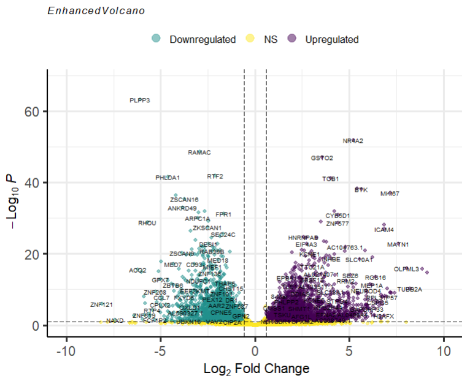
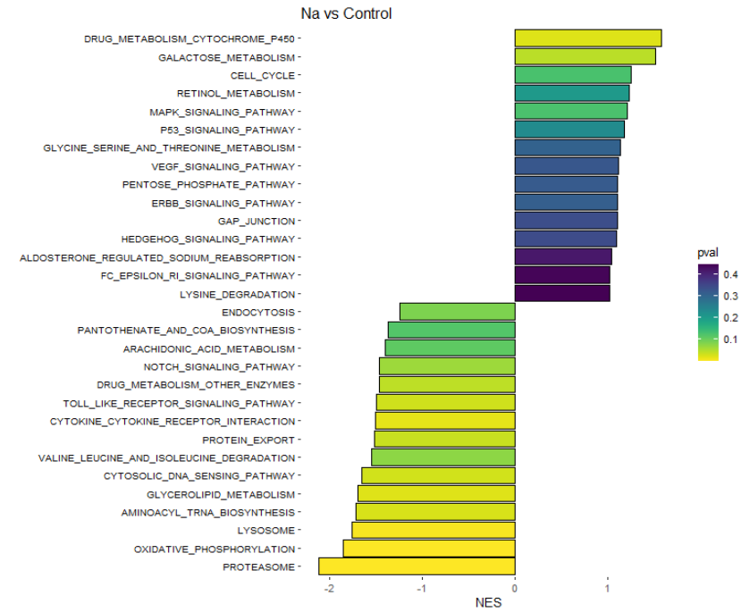

# 🧪 Bulk RNA-seq Analysis of Neutrophils Exposed to High NaCl

This repository contains selected code and visualizations from a bulk RNA-seq project analyzing the transcriptional response of human neutrophils exposed to hypertonic NaCl conditions.

⚠️ Full datasets and code are **not shared at this time** due to ongoing manuscript submission.

---

## 🧬 Project Summary

- **Model**: Human neutrophils stimulated with high extracellular NaCl
- **Goal**: Identify transcriptional changes and uncover NaCl-induced immune programs
- **Tools**: DESeq2, fgsea, EnhancedVolcano, ggplot2, pheatmap

---

## 🧪 Analysis Overview

- Differential expression analysis using **DESeq2**
- Derivation of NaCl-responsive gene signatures
- Functional enrichment via **GSEA (fgseaMultilevel)** using curated KEGG pathways
- Visualization of DEGs and enriched biological processes

---

## 📊 Example Output

### Volcano Plot
*(DEGs in NaCl-stimulated neutrophils vs. control)*  

---

### GSEA Barplot
*(Top 30 enriched KEGG pathways sorted by Normalized Enrichment Score)*  

---

## 📁 Repository Structure

- `/code`: Partial scripts used for analysis and plotting  
- `/figures`: Final visualizations (non-reproducible for now)  

---

## 🧾 Conclusion

This preliminary analysis allowed us to explore how exposure to high extracellular NaCl reprograms the transcriptional landscape of human neutrophils. Through differential gene expression, enrichment analyses, and visualization, we identified key pathways related to inflammation, immune regulation, and potential links to cancer biology.

These results lay the foundation for further investigation of salt-induced neutrophil plasticity and its relevance in chronic inflammatory conditions and the tumor microenvironment.

---

## 📫 Contact

Feel free to reach out via [LinkedIn](https://www.linkedin.com/in/ignaciomazzitelli) if you're interested in the methodology, the dataset, or future collaborations.

---

🧪 *“Bridging biology and artificial intelligence through curiosity, critical thinking, and code.”*
